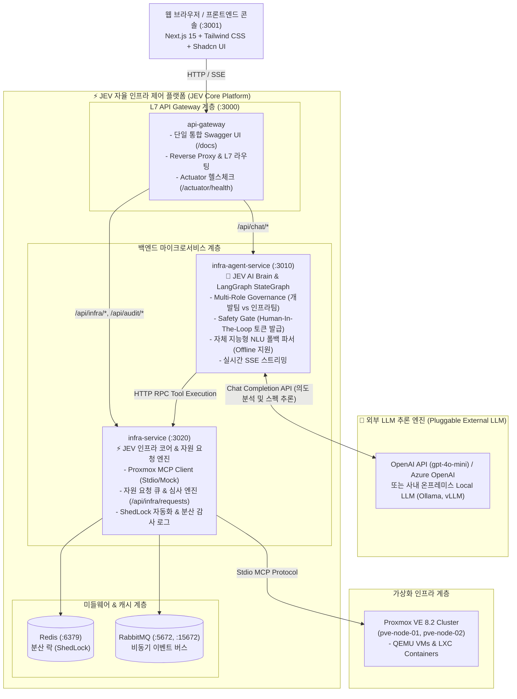
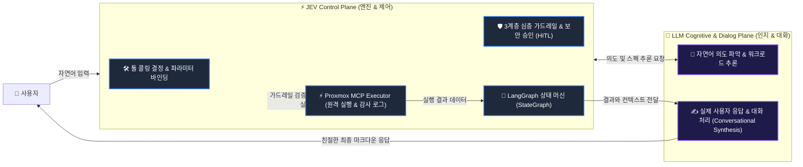

# ⚡ JEV: Proxmox MCP & LangGraph 자율 인프라 거버넌스 플랫폼

> **NestJS MSA (`nest-msa`) 템플릿**, **`Theorvane/proxmox-mcp` (Model Context Protocol)**, **LangGraph AI StateGraph**, 그리고 **Next.js 15 프론트엔드 콘솔**을 결합하여 가상화 인프라를 자율 제어하고 팀 간 거버넌스를 보장하는 차세대 엔터프라이즈 AI 인프라 오케스트레이션 플랫폼입니다.

---

## 📚 상세 기술 문서 바로가기

| 문서 | 링크 | 내용 요약 |
| :--- | :--- | :--- |
| **시스템 아키텍처** | [docs/ARCHITECTURE.md](docs/ARCHITECTURE.md) | MSA 토폴로지, LangGraph StateGraph 파이프라인, 포트 맵 |
| **거버넌스 & 3중 가드레일** | [docs/GOVERNANCE_AND_GUARDRAILS.md](docs/GOVERNANCE_AND_GUARDRAILS.md) | 개발팀 vs 인프라팀 분리, HITL 승인 토큰, 다계층 방어선 |
| **API 참조 명세서** | [docs/API_REFERENCE.md](docs/API_REFERENCE.md) | L7 Gateway, 자원 요청/승인, SSE 챗봇 스트림, 인프라 REST API |
| **사용자 시나리오 가이드** | [docs/USER_SCENARIOS.md](docs/USER_SCENARIOS.md) | 자원 신청, 심사 및 자동 프로비저닝, 파괴적 작업 보안 승인 |

---

## 🏛️ 시스템 아키텍처 개요

본 프로젝트는 **JEV 코어 플랫폼(오케스트레이터 & 거버넌스 엔진)**과 **외부 LLM(언어 모델 추론 엔진)**을 완전히 분리(Decoupled)하고, 인프라 제어 코어(`infra-service`)와 AI 에이전트(`infra-agent-service`)를 마이크로서비스로 구성하였습니다.



---

## ⚖️ JEV vs LLM 명확한 역할 분담 원칙

> 🎯 **핵심 아키텍처 원칙**:  
> **"JEV가 툴 콜링(Tool Calling)과 가드레일(Guardrails)을 전담하고, LLM은 실제 응답(Conversational Response)과 대화 처리를 전담한다."**



| 구분 | ⚡ JEV (`jev-langgraph-example`) | 🤖 외부 LLM (OpenAI / Ollama 등) |
| :--- | :--- | :--- |
| **담당 영역** | **제어 및 실행 평면 (Control & Execution Plane)** | **인지 및 대화 평면 (Cognitive & Dialog Plane)** |
| **주요 역할** | • **툴 콜링 오케스트레이션 (Tool Calling Decision)**<br/>• **3계층 가드레일 (역할 분리, 파괴적 작업 차단, HITL 토큰)**<br/>• LangGraph StateGraph 전이 및 상태 보존<br/>• Proxmox MCP 도구 원격 실행 & 분산 락/감사 로그 적재<br/>• LLM 없이도 동작하는 결정론적 폴백 엔진 내장 | • 사용자 자연어 발화의 문맥 및 뉘앙스 이해<br/>• 워크로드별 리소스 스펙(CPU/RAM/Disk) 추론 제안<br/>• **도구 실행 결과를 바탕으로 친절하고 자연스러운 대화형 답변 생성**<br/>• 비전문가도 이해하기 쉬운 안내 및 다음 단계 권장 |

## 🌟 핵심 기능 및 엔터프라이즈 거버넌스

### 1. 역할 기반 거버넌스 (개발팀 vs 인프라팀)
- **개발팀 (DEV_TEAM)**:
  - 프로덕션 클러스터의 자원을 임의로 직접 생성하거나 삭제할 수 없습니다.
  - 전용 UI(`/requests`) 또는 AI 챗봇(*"2코어 4기가 램 20GB 디스크로 VM 하나 만들어줘"*)을 통해 **자원 신청 티켓(`REQ-XXXX`)**을 발급합니다.
- **인프라팀 (INFRA_TEAM)**:
  - 개발팀의 대기 큐를 실시간 모니터링하고 노드 잔여 용량을 확인합니다.
  - **"승인 및 자동 프로비저닝"** 클릭 시 Proxmox MCP를 호출하여 실제 클러스터에 VM 생성/디스크 확장을 즉시 실행하고 결과(`VMID`, `UPID`)를 영구 기록합니다.

### 2. 3계층 심층 방어 가드레일 (3-Tier Deep Guardrails)
- **Tier 1 (역할 거버넌스 가드)**: 개발팀의 인프라 직접 변경 시도를 원천 차단하고 승인 대기 티켓으로 자동 격리.
- **Tier 2 (파괴적 작업 HITL 게이트)**: VM 삭제(`qemu_delete`), 강제 종료(`qemu_force_stop`) 등 위험 명령 감지 시 실행 즉시 중단(Interrupt) 및 1회용 승인 토큰(`cf_xxxx`, 5분 TTL) 발급.
- **Tier 3 (마이크로서비스 MCP 가드)**: AI를 우회한 직접 API 호출 시에도 `confirm: true` 인수가 없으면 하부 실행 차단.

### 3. 지능형 LLM & NLU 워크로드 사이징
- LLM API 키가 있을 경우 `ChatOpenAI`가 자연어의 맥락을 분석하여 구조화된 JSON 파라미터를 산출합니다.
- 오프라인/테스트 환경에서도 정규표현식 스펙 추출기 및 용도 기반 추론 엔진(AI/머신러닝은 8C/16GB/100GB, DB는 4C/8GB/50GB 등)이 동작합니다.

### 4. L7 단일 통합 Swagger UI
- 마이크로서비스로 분리되어 있음에도 Gateway가 모든 API 스펙을 집계하여 [http://localhost:3000/docs](http://localhost:3000/docs) 단일 주소에서 통합 문서를 제공합니다.

---

## 📂 프로젝트 구조

```
jev-langgraph-example/
├── docs/                               # 상세 기술 문서 및 사용자 가이드
│   ├── ARCHITECTURE.md                 # MSA 토폴로지, StateGraph, MCP 연동
│   ├── GOVERNANCE_AND_GUARDRAILS.md    # 다계층 가드레일 및 승인 라이프사이클
│   ├── API_REFERENCE.md                # 전체 API 명세서 및 SSE 스트림 규격
│   └── USER_SCENARIOS.md               # 주요 역할별 사용 시나리오
├── backend/                            # NestJS Monorepo (nest-msa 아키텍처)
│   ├── apps/
│   │   ├── api-gateway/                # L7 API Gateway (:3000): 통합 Swagger, Actuator
│   │   ├── infra-agent-service/        # AI Brain (:3010): LangGraph 상태 머신, 가드레일
│   │   └── infra-service/              # Core Infra (:3020): Proxmox MCP, 자원 승인 엔진
│   └── libs/
│       ├── common/                     # 로거, 분산 락, Redis
│       └── contracts/                  # DTOs, LangGraph State, Tool Schemas
├── frontend/                           # Next.js 15 (App Router) + Tailwind CSS + Shadcn UI
│   ├── src/app/                        # 대시보드 메인
│   ├── src/app/requests/               # 자원 요청 & 승인 센터 (개발팀/인프라팀)
│   ├── src/app/chat/                   # AI 인프라 챗봇 콘솔 (실시간 SSE)
│   └── src/app/automation/             # 자율 복구 규칙 & 감사 로그 타임라인
└── infra/                              # 인프라 & 배포 환경
    ├── docker-compose.yml              # 전체 시스템 통합 컨테이너 오케스트레이션
    ├── proxmox-mcp/                    # Theorvane/proxmox-mcp 소스코드 & 빌드 환경
    └── env/.env.example                # 환경 설정 템플릿
```

---

## 🚀 빠른 시작 (Quick Start)

### 1. Docker Compose 원클릭 실행 (권장)
```bash
docker compose -f infra/docker-compose.yml up -d --build
```
> **Proxmox 자격 증명이 없어도 즉시 구동됩니다!** 기본적으로 고정밀 시뮬레이션(High-Fidelity Mock) 엔진이 활성화되어 실제 Proxmox VE 8.2 클러스터 환경과 100% 동일하게 동작합니다.

### 2. 서비스 접속 주소

| 서비스 | URL | 설명 |
| :--- | :--- | :--- |
| **웹 콘솔 (자원 요청 & 승인)** | [http://localhost:3001/requests](http://localhost:3001/requests) | 개발팀 신청 및 인프라팀 원클릭 승인/프로비저닝 |
| **웹 콘솔 (AI 챗봇)** | [http://localhost:3001/chat](http://localhost:3001/chat) | 자연어 인프라 제어 및 의사결정 추적(Trace) |
| **웹 콘솔 (대시보드)** | [http://localhost:3001](http://localhost:3001) | 클러스터 노드/VM 리소스 실시간 모니터링 |
| **단일 통합 Swagger API** | [http://localhost:3000/docs](http://localhost:3000/docs) | L7 Gateway 단일 통합 OpenAPI 문서 |
| **게이트웨이 헬스체크** | [http://localhost:3000/actuator/health](http://localhost:3000/actuator/health) | 시스템 정상 가동 상태 확인 |

### 3. 백엔드 테스트 실행
```bash
cd backend
pnpm build
npx tsx --tsconfig ./tsconfig.json --test test/backend.spec.ts
```
> Actuator, Proxmox MCP Client, LangGraph Agent, Safety Gate, Resource Request Governance 등 14개 통합 테스트가 100% 통과합니다.
