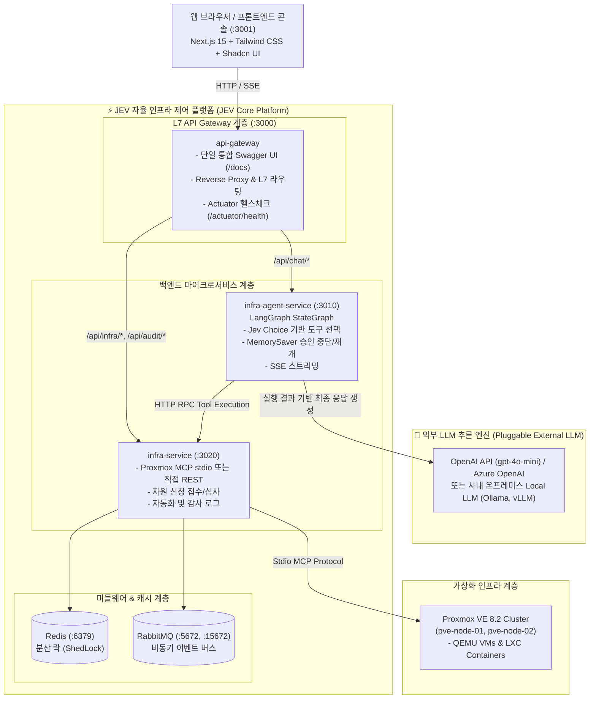
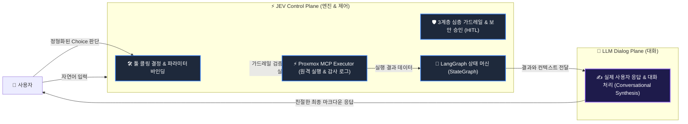

# ⚡ JEV: Proxmox MCP & LangGraph 자율 인프라 거버넌스 플랫폼

> **NestJS MSA (`nest-msa`) 템플릿**, **`Theorvane/proxmox-mcp` (Model Context Protocol)**, **LangGraph AI StateGraph**, 그리고 **Next.js 15 프론트엔드 콘솔**을 결합하여 가상화 인프라를 자율 제어하고 팀 간 거버넌스를 보장하는 차세대 엔터프라이즈 AI 인프라 오케스트레이션 플랫폼입니다.

---

## 📚 상세 기술 문서 바로가기

| 문서 | 링크 | 내용 요약 |
| :--- | :--- | :--- |
| **시스템 아키텍처** | [docs/ARCHITECTURE.md](docs/ARCHITECTURE.md) | MSA 토폴로지, LangGraph StateGraph 파이프라인, 포트 맵 |
| **학습·면접 가이드** | [docs/INTERVIEW_STUDY_GUIDE.md](docs/INTERVIEW_STUDY_GUIDE.md) | 현재 코드 기준 컴포넌트, Jev 순환 그래프, 체크포인터, 실행 예시와 한계 |
| **거버넌스 & 3중 가드레일** | [docs/GOVERNANCE_AND_GUARDRAILS.md](docs/GOVERNANCE_AND_GUARDRAILS.md) | 개발팀 vs 인프라팀 분리, HITL 승인 토큰, 다계층 방어선 |
| **API 참조 명세서** | [docs/API_REFERENCE.md](docs/API_REFERENCE.md) | L7 Gateway, 자원 요청/승인, SSE 챗봇 스트림, 인프라 REST API |
| **사용자 시나리오 가이드** | [docs/USER_SCENARIOS.md](docs/USER_SCENARIOS.md) | 자원 신청, 심사 및 자동 프로비저닝, 파괴적 작업 보안 승인 |

---

## 🏛️ 시스템 아키텍처 개요

본 프로젝트는 **JEV 코어 플랫폼(오케스트레이터 & 거버넌스 엔진)**과 **외부 LLM(언어 모델 추론 엔진)**을 완전히 분리(Decoupled)하고, 인프라 제어 코어(`infra-service`)와 AI 에이전트(`infra-agent-service`)를 마이크로서비스로 구성하였습니다.


```mermaid
flowchart TB
    Client["웹 브라우저 / 프론트엔드 콘솔 (:3001)<br/>Next.js 15 + Tailwind CSS + Shadcn UI"]

    subgraph ExternalLLM ["🤖 외부 LLM 추론 엔진 (Pluggable External LLM)"]
        LLMProvider["OpenAI API (gpt-4o-mini) / Azure OpenAI<br/>또는 사내 온프레미스 Local LLM (Ollama, vLLM)"]
    end

    subgraph JEVPlatform ["⚡ JEV 자율 인프라 제어 플랫폼 (JEV Core Platform)"]
        subgraph GatewayLayer ["L7 API Gateway 계층 (:3000)"]
            Gateway["api-gateway<br/>- 단일 통합 Swagger UI (/docs)<br/>- Reverse Proxy & L7 라우팅<br/>- Actuator 헬스체크 (/actuator/health)"]
        end

        subgraph ServiceLayer ["백엔드 마이크로서비스 계층"]
            AgentService["infra-agent-service (:3010)<br/>LangGraph StateGraph<br/>- Jev Choice 기반 도구 선택<br/>- MemorySaver 승인 중단/재개<br/>- SSE 스트리밍"]
            InfraService["infra-service (:3020)<br/>- Proxmox MCP stdio 또는 직접 REST<br/>- 자원 신청 접수/심사<br/>- 자동화 및 감사 로그"]
        end

        subgraph StorageLayer ["미들웨어 & 캐시 계층"]
            Redis[("Redis (:6379)<br/>분산 락 (ShedLock)")]
            RabbitMQ[("RabbitMQ (:5672, :15672)<br/>비동기 이벤트 버스")]
        end
    end

    subgraph ProxmoxLayer ["가상화 인프라 계층"]
        PVECluster["Proxmox VE 8.2 Cluster<br/>(pve-node-01, pve-node-02)<br/>- QEMU VMs & LXC Containers"]
    end

    Client -->|"HTTP / SSE"| Gateway
    Gateway -->|"/api/chat/*"| AgentService
    Gateway -->|"/api/infra/*, /api/audit/*"| InfraService
    
    %% JEV와 외부 LLM 간의 인터페이스
    AgentService -->|"실행 결과 기반 최종 응답 생성"| LLMProvider

    AgentService -->|"HTTP RPC Tool Execution"| InfraService
    InfraService --> Redis
    InfraService --> RabbitMQ
    InfraService -->|"Stdio MCP Protocol"| PVECluster
```

---

## ⚖️ JEV vs LLM 명확한 역할 분담 원칙

> 🎯 **핵심 아키텍처 원칙**:  
> **"JEV가 툴 콜링(Tool Calling)과 가드레일(Guardrails)을 전담하고, LLM은 실제 응답(Conversational Response)과 대화 처리를 전담한다."**


```mermaid
graph LR
    User["👤 사용자"]
    
    subgraph JEV ["⚡ JEV Control Plane (엔진 & 제어)"]
        TC["🛠️ 툴 콜링 결정 & 파라미터 바인딩"]
        GR["🛡️ 3계층 심층 가드레일 & 보안 승인 (HITL)"]
        SG["🔄 LangGraph 상태 머신 (StateGraph)"]
        MC["⚡ Proxmox MCP Executor (원격 실행 & 감사 로그)"]
    end

    subgraph LLM ["🤖 LLM Dialog Plane (대화)"]
        RESP["✍️ 실제 사용자 응답 & 대화 처리 (Conversational Synthesis)"]
    end

    User -->|"자연어 입력"| JEV
    User -->|"정형화된 Choice 판단"| TC
    JEV -->|"가드레일 검증 및 Proxmox 실행"| MC
    MC -->|"실행 결과 데이터"| SG
    SG -->|"결과와 컨텍스트 전달"| RESP
    RESP -->|"친절한 최종 마크다운 응답"| User

    classDef jev fill:#1e293b,stroke:#3b82f6,stroke-width:2px,color:#fff;
    classDef llm fill:#1e1b4b,stroke:#8b5cf6,stroke-width:2px,color:#fff;
    class TC,GR,SG,MC jev;
    class RESP llm;
```

| 구분 | ⚡ JEV (`jev-langgraph-example`) | 🤖 외부 LLM (OpenAI / Ollama 등) |
| :--- | :--- | :--- |
| **담당 영역** | **제어 및 실행 평면 (Control & Execution Plane)** | **인지 및 대화 평면 (Cognitive & Dialog Plane)** |
| **주요 역할** | • JEV Choice로 도구·신청 유형·워크로드·규모 판단<br/>• 역할·확률·인수 검증과 HITL 승인<br/>• LangGraph 상태 전이와 Proxmox MCP 실행<br/>• LLM 미설정 시 기본 결과 표시 | • **도구 실행 결과를 바탕으로 사용자용 대화형 답변 생성** |

## 🌟 핵심 기능 및 엔터프라이즈 거버넌스

### 1. 역할 기반 거버넌스 (개발팀 vs 인프라팀)
- **개발팀 (DEV_TEAM)**:
  - 프로덕션 클러스터의 자원을 임의로 직접 생성하거나 삭제할 수 없습니다.
  - 전용 UI(`/requests`) 또는 AI 챗봇(*"2코어 4기가 램 20GB 디스크로 VM 하나 만들어줘"*)을 통해 **자원 신청 티켓(`REQ-XXXX`)**을 발급합니다.
- **인프라팀 (INFRA_TEAM)**:
  - 개발팀의 대기 큐를 실시간 모니터링하고 노드 잔여 용량을 확인합니다.
  - 자원 신청 승인 시 VM 생성 또는 디스크 확장을 시도하고 결과를 현재 프로세스 메모리에 기록합니다. 실패하면 `APPROVED` 상태로 남을 수 있습니다.

### 2. 3계층 심층 방어 가드레일 (3-Tier Deep Guardrails)
- **Tier 1 (역할 거버넌스 가드)**: 개발팀의 인프라 직접 변경은 차단하고, 명시적인 자원 신청 요청만 승인 대기 티켓으로 접수.
- **Tier 2 (파괴적 작업 HITL 게이트)**: VM 삭제(`qemu_delete`), 강제 종료(`qemu_force_stop`) 등 위험 명령 감지 시 실행 즉시 중단(Interrupt) 및 1회용 승인 토큰(`cf_xxxx`, 5분 TTL) 발급.
- **Tier 3 (마이크로서비스 MCP 가드)**: AI를 우회한 직접 API 호출 시에도 `confirm: true` 인수가 없으면 하부 실행 차단.

### 3. JEV 의사결정과 LLM 응답
- `router`는 JEV System One API에 도구 선택, 자원 신청 유형, 검토 결과, 워크로드, 규모를 한 요청의 독립적인 Choice 질문으로 보냅니다.
- JEV가 고른 도구는 코드의 허용 목록, 선택 확률, 역할, 필수 인수 검증을 거칩니다. VMID, 노드, 요청 번호와 명시된 사양은 코드에서 추출합니다. 대상이 모호하면 실행하지 않고 추가 정보를 요청합니다.
- `synthesizer`에서만 설정된 LLM을 호출하여 실행 결과를 사용자용 문장으로 정리합니다. LLM이 없으면 JEV 판단과 도구 실행은 유지하고 결과를 기본 형식으로 표시합니다.
- JEV 인증은 `JEV_API_KEY` 또는 JEV Basic Auth, 대화 응답 모델 인증은 `LLM_API_KEY`로 각각 설정합니다.

### 4. L7 단일 통합 Swagger UI
- 마이크로서비스로 분리되어 있음에도 Gateway가 모든 API 스펙을 집계하여 [http://localhost:3000/docs](http://localhost:3000/docs) 단일 주소에서 통합 문서를 제공합니다.

---

## 📂 프로젝트 구조

```
jev-langgraph-example/
├── docs/                               # 상세 기술 문서 및 사용자 가이드
│   ├── ARCHITECTURE.md                 # MSA 토폴로지, StateGraph, MCP 연동
│   ├── INTERVIEW_STUDY_GUIDE.md        # 코드 기준 구조 설명, 면접 Q&A, 현재 한계
│   ├── GOVERNANCE_AND_GUARDRAILS.md    # 다계층 가드레일 및 승인 라이프사이클
│   ├── API_REFERENCE.md                # 전체 API 명세서 및 SSE 스트림 규격
│   └── USER_SCENARIOS.md               # 주요 역할별 사용 시나리오
├── backend/                            # NestJS Monorepo (nest-msa 아키텍처)
│   ├── apps/
│   │   ├── api-gateway/                # L7 API Gateway (:3000): 통합 Swagger, Actuator
│   │   ├── infra-agent-service/        # AI Brain (:3010): LangGraph 상태 머신, 가드레일
│   │   └── infra-service/              # Core Infra (:3020): Proxmox MCP, 자원 승인 엔진
│   └── libs/
│       ├── common/                     # 로거, 분산 락, Redis
│       └── contracts/                  # DTOs, LangGraph State, Tool Schemas
├── frontend/                           # Next.js 15 (App Router) + Tailwind CSS + Shadcn UI
│   ├── src/app/                        # 대시보드 메인
│   ├── src/app/requests/               # 자원 요청 & 승인 센터 (개발팀/인프라팀)
│   ├── src/app/chat/                   # AI 인프라 챗봇 콘솔 (실시간 SSE)
│   └── src/app/automation/             # 자율 복구 규칙 & 감사 로그 타임라인
└── infra/                              # 인프라 & 배포 환경
    ├── docker-compose.yml              # 전체 시스템 통합 컨테이너 오케스트레이션
    ├── proxmox-mcp/                    # Theorvane/proxmox-mcp 소스코드 & 빌드 환경
    └── env/.env.example                # 환경 설정 템플릿
```

---

## 🚀 빠른 시작 (Quick Start)

### 1. Docker Compose 원클릭 실행 (권장)
```bash
docker compose -f infra/docker-compose.yml up -d --build
```
> Proxmox 연결 정보가 없으면 웹 서비스는 시작할 수 있지만 실제 클러스터 조회·변경은 실패합니다. 현재 `ProxmoxMcpClient.isSimulated()`는 `false`를 반환합니다.

### 2. 서비스 접속 주소

| 서비스 | URL | 설명 |
| :--- | :--- | :--- |
| **웹 콘솔 (자원 요청 & 승인)** | [http://localhost:3001/requests](http://localhost:3001/requests) | 개발팀 신청 및 인프라팀 원클릭 승인/프로비저닝 |
| **웹 콘솔 (AI 챗봇)** | [http://localhost:3001/chat](http://localhost:3001/chat) | 자연어 인프라 제어 및 의사결정 추적(Trace) |
| **웹 콘솔 (대시보드)** | [http://localhost:3001](http://localhost:3001) | 클러스터 노드/VM 리소스 실시간 모니터링 |
| **단일 통합 Swagger API** | [http://localhost:3000/docs](http://localhost:3000/docs) | L7 Gateway 단일 통합 OpenAPI 문서 |
| **게이트웨이 헬스체크** | [http://localhost:3000/actuator/health](http://localhost:3000/actuator/health) | 시스템 정상 가동 상태 확인 |

### 3. 백엔드 테스트 실행
```bash
cd backend
pnpm build
npx tsx --tsconfig ./tsconfig.json --test test/backend.spec.ts
```
> LangGraph 에이전트의 Jev 재판단, 도구 순환 제한, 승인·거절·만료 경로는 `backend/apps/infra-agent-service/src/agent/langgraph-agent.service.spec.ts`에서 mock 기반으로 검증합니다.
