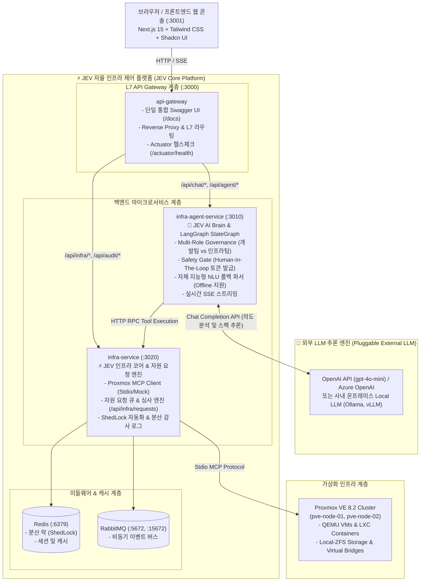
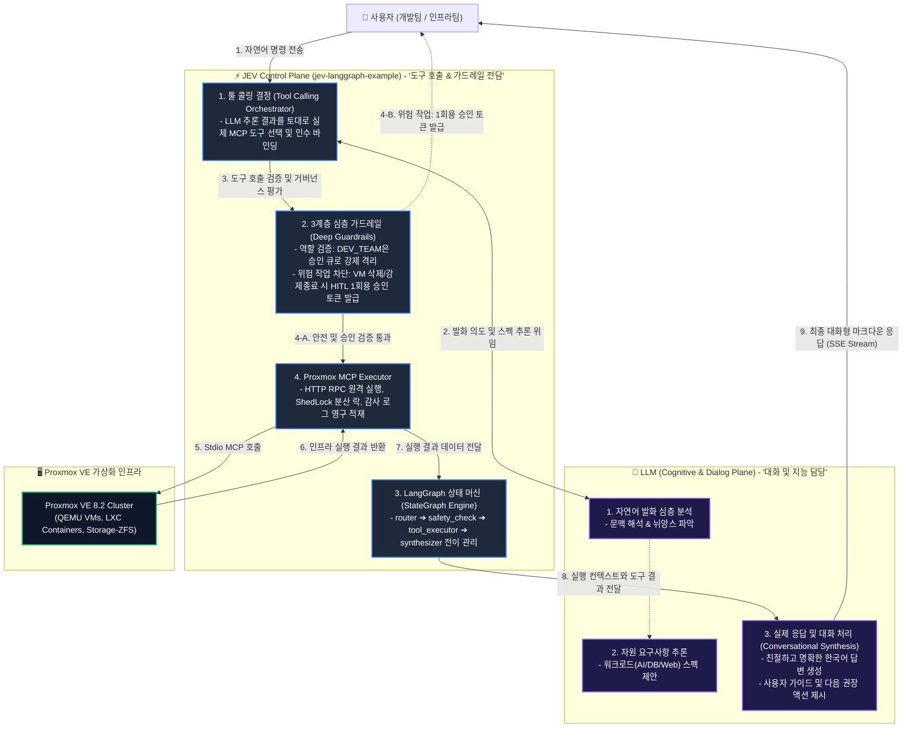
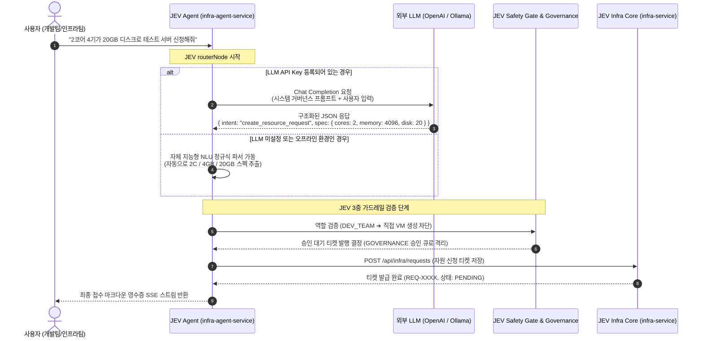
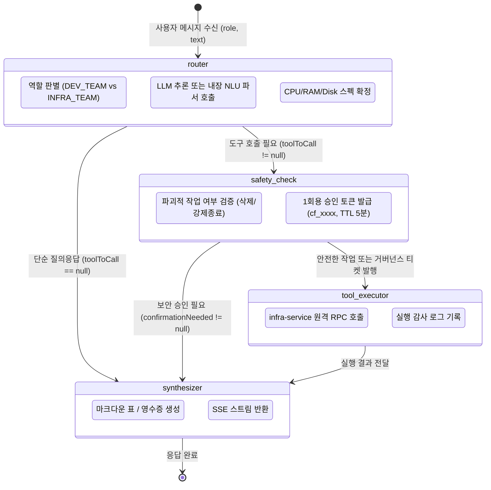

# 🏛️ JEV 시스템 아키텍처 명세서 (System Architecture)

JEV(`jev-langgraph-example`)는 **NestJS 기반 마이크로서비스 아키텍처(MSA)**, **Theorvane/proxmox-mcp (Model Context Protocol)**, **LangGraph AI StateGraph**, **Next.js 15 프론트엔드 콘솔**을 결합하여 가상화 인프라를 자율 제어하고 팀 간 거버넌스를 보장하는 차세대 AI 인프라 플랫폼입니다.

특히 **JEV(자율 인프라 오케스트레이션 프레임워크)**와 **LLM(외부 언어 모델 추론 엔진)**은 완전히 분리(Decoupled)되어 있어, LLM 모델 교체 시에도 인프라 제어 및 거버넌스 규칙이 영향받지 않는 모듈러 아키텍처를 자랑합니다.

---

## 1. 전체 토폴로지 및 MSA 구성 (JEV vs 외부 LLM 분리)

---

---

## 2. JEV Core와 외부 LLM의 명확한 역할 분리 (Decoupled Responsibilities)

> 💡 **핵심 설계 원칙 (Core Architectural Principle)**:  
> **"JEV가 툴 콜링(Tool Calling)과 가드레일(Guardrails)을 전담하고, LLM은 실제 응답(Conversational Response)과 대화 처리를 전담한다."**

JEV는 **LLM 그 자체가 아니며, LLM에 결코 종속되지 않습니다.**  
인프라에 대한 실질적인 변경 권한, 도구 선택, 보안 승인, 상태 머신 통제는 모두 **JEV(제어 평면: Control & Governance Plane)**가 담당하며, **LLM(인지/대화 평면: Cognitive & Dialog Plane)**은 사용자와의 자연스러운 상호작용 및 설명 생성을 전담하는 플러그인 엔진으로 동작합니다.

### 상세 책임 매트릭스 (Responsibility Matrix)

| 구분 | ⚡ JEV 코어 제어 평면 (`jev-langgraph-example`) | 🤖 외부 LLM 인지/대화 평면 (External LLM) |
| :--- | :--- | :--- |
| **핵심 역할** | **툴 콜링(Tool Calling) & 가드레일(Guardrails) & 인프라 통제** | **실제 대화 처리(Conversational Dialog) & 응답 생성(Response Synthesis)** |
| **주요 기능** | • LangGraph 기반 상태 전이 관리 (`StateGraph`) • **도구 결정 및 파라미터 유효성 검증 (Tool Calling)** • **역할 거버넌스 강제 (`DEV_TEAM`은 승인 큐로 격리)** • **파괴적 작업 차단 및 HITL 1회용 승인 토큰 라이프사이클** • Proxmox MCP 프로토콜 브릿지 및 원격 RPC 실행 • 감사 로그(Audit Logs) 및 분산 락(ShedLock) 영구 적재 • LLM 장애 시에도 100% 작동하는 내장 NLU 파서 보유 | • 비정형 자연어 발화의 문맥 및 사용자 의도 이해 • 발화 내용으로부터 CPU/RAM/Disk 스펙 추론 • **도구 실행 결과를 바탕으로 친절하고 자연스러운 한국어 대화 응답 생성** • 기술적 인프라 상태를 비전문가도 이해할 수 있는 설명문으로 변환 • 다음 권장 행동에 대한 대화형 안내 |
| **결합도 & 의존성** | **완전 분리(Decoupled)**: LLM이 다운되거나 오프라인이어도 JEV 내부 룰 엔진으로 인프라 제어 완전 보장 | **교체 가능(Pluggable)**: OpenAI API, Azure OpenAI, 온프레미스 Local LLM (Ollama, vLLM) 등으로 자유 교체 가능 |
| **보안 & 안정성** | **결정론적(Deterministic) 보장**: LLM의 환각(Hallucination)에 의한 무단 인프라 조작을 코드 레벨 가드레일로 원천 차단 | 프롬프트 컨텍스트에 기반하여 최적의 대화 톤앤매너 및 요약 유지 |

---

## 3. JEV AI Brain과 LLM 간의 인터랙션 시퀀스

사용자가 채팅창에 입력했을 때, JEV가 LLM을 어떻게 호출하고 통제하는지 보여주는 시퀀스 다이어그램입니다:

---

## 4. 서비스별 포트 및 역할

| 서비스 명칭 | 포트 | 프로토콜 | 소속 / 역할 |
| :--- | :---: | :---: | :--- |
| **`pve-frontend-console`** | `3001` | HTTP | JEV 프론트엔드 (Next.js 15, 실시간 대시보드, 자원 요청 센터, AI 챗봇) |
| **`pve-api-gateway`** | `3000` | HTTP | JEV L7 게이트웨이 (단일 통합 Swagger UI `/docs`, SSE 리버스 프록시) |
| **`pve-infra-agent`** | `3010` | HTTP/SSE | JEV AI Brain (LangGraph 상태 머신, 가드레일, LLM 인터페이스) |
| **`pve-infra-service`** | `3020` | HTTP | JEV 인프라 코어 (Proxmox MCP 통신, 자원 승인 큐, ShedLock, 감사 로그) |
| **`pve-infra-redis`** | `6379` | TCP | JEV 미들웨어 (분산 락, 스케줄러 동기화, 세션 캐시) |
| **`pve-infra-rabbitmq`** | `5672` / `15672` | AMQP / HTTP | JEV 미들웨어 (비동기 이벤트 버스 및 관리자 웹 콘솔) |
| **외부 LLM (External)** | `443` or `11434` | HTTPS / HTTP | 외부 공급자 (OpenAI API 클라우드 또는 Ollama 온프레미스 로컬 인스턴스) |

---

## 5. LangGraph AI 상태 머신 (StateGraph Workflow)

`infra-agent-service`는 LangGraph의 `StateGraph`를 통해 사용자의 요청을 4단계 파이프라인으로 엄격히 통제합니다:

### 상태 채널 정의 (`InfraAgentState`)
- `messages`: 대화 히스토리 (BaseMessage 배열)
- `role`: 활성 사용자 역할 (`DEV_TEAM` | `INFRA_TEAM`)
- `requesterName`: 요청자 성명/식별자
- `intent`: 분류된 의도 (`create_resource_request`, `review_resource_request`, `qemu_start` 등)
- `toolToCall`: 호출할 도구명과 바인딩된 JSON 인수
- `toolResult`: 원격 실행 결과
- `confirmationNeeded`: 파괴적 작업 차단 시 발급된 승인 토큰 정보
- `decisionWhy`: AI가 이 도구와 인수를 선택한 구체적 추론 근거
- `safetyEvaluation`: 안전성 평가 등급 (`SAFE`, `GOVERNANCE`, `CAUTION`)
- `finalResponse`: 최종 마크다운 응답

---

## 6. 원격 MCP 실행 아키텍처 (Decoupled MCP Architecture)

AI 에이전트와 실제 인프라 제어 계층의 책임을 분리하여 높은 보안성과 확장성을 보장합니다:

1. **에이전트 계층 (`infra-agent-service`)**:
   - 사용자의 자연어를 분석하고 스펙을 도출하지만, Proxmox VE와 직접 네트워크로 연결되지 않습니다.
   - HTTP 통신 기반의 [`InfraRemoteClient`](file:///z:/home/ubuntu/jev-langgraph-example/backend/apps/infra-agent-service/src/agent/infra-remote.client.ts)를 통해 `infra-service`로 원격 툴 실행을 요청합니다.
2. **인프라 코어 계층 (`infra-service`)**:
   - `ProxmoxMcpClient`를 보유하여 Theorvane/proxmox-mcp의 Stdio 프로세스를 직접 관리합니다.
   - `POST /api/infra/tools/execute` 엔드포인트를 통해 에이전트의 원격 툴 호출을 안전하게 수신하고 검증합니다.
   - 실제 자격 증명이 없는 개발 환경을 위해 **초고정밀 시뮬레이션(High-Fidelity Mock) 엔진**을 기본 내장하여 즉각적인 검증이 가능합니다.
