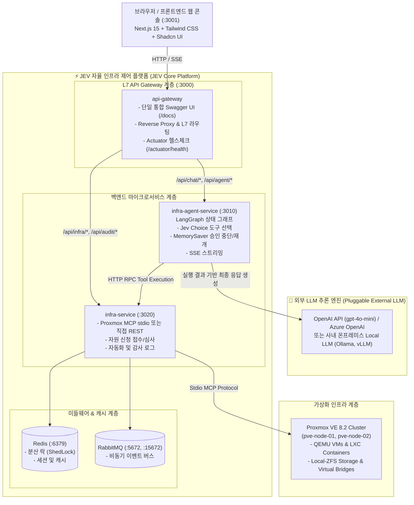
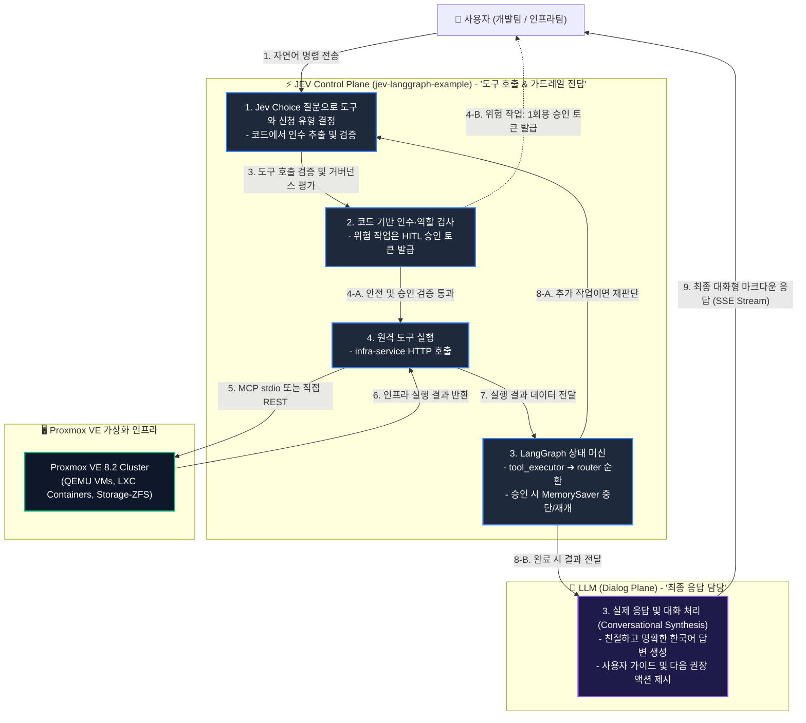
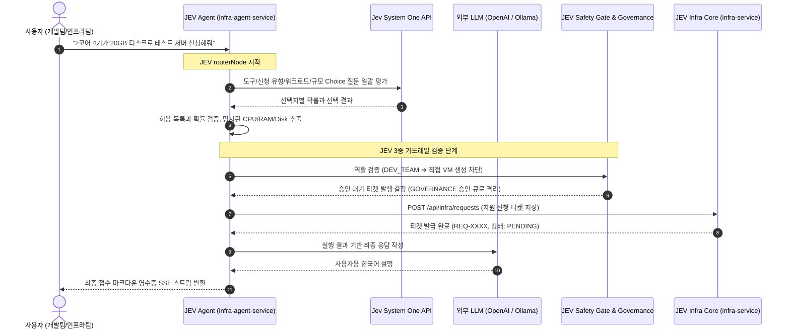
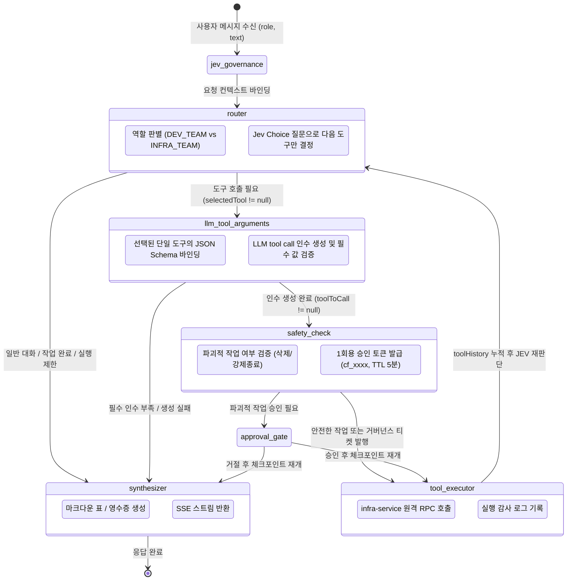

# 🏛️ JEV 시스템 아키텍처 명세서 (System Architecture)

> 현재 구현을 기준으로 노드·엣지·컴포넌트·제약을 학습하려면 [학습 및 면접 가이드](INTERVIEW_STUDY_GUIDE.md)를 먼저 읽어 주세요. 아래의 일부 도표와 설명은 초기 설계 의도를 포함합니다.

JEV(`jev-langgraph-example`)는 **NestJS 기반 마이크로서비스 아키텍처(MSA)**, **Theorvane/proxmox-mcp (Model Context Protocol)**, **LangGraph AI StateGraph**, **Next.js 15 프론트엔드 콘솔**을 결합하여 가상화 인프라를 자율 제어하고 팀 간 거버넌스를 보장하는 차세대 AI 인프라 플랫폼입니다.

특히 **JEV(자율 인프라 오케스트레이션 프레임워크)**와 **LLM(외부 언어 모델 추론 엔진)**은 완전히 분리(Decoupled)되어 있어, LLM 모델 교체 시에도 인프라 제어 및 거버넌스 규칙이 영향받지 않는 모듈러 아키텍처를 자랑합니다.

---

## 1. 전체 토폴로지 및 MSA 구성 (JEV vs 외부 LLM 분리)

```mermaid
flowchart TB
    Client["브라우저 / 프론트엔드 웹 콘솔 (:3001)<br/>Next.js 15 + Tailwind CSS + Shadcn UI"]

    subgraph ExternalLLM ["🤖 외부 LLM 추론 엔진 (Pluggable External LLM)"]
        LLMProvider["OpenAI API (gpt-4o-mini) / Azure OpenAI<br/>또는 사내 온프레미스 Local LLM (Ollama, vLLM)"]
    end

    subgraph JEVPlatform ["⚡ JEV 자율 인프라 제어 플랫폼 (JEV Core Platform)"]
        subgraph GatewayLayer ["L7 API Gateway 계층 (:3000)"]
            Gateway["api-gateway<br/>- 단일 통합 Swagger UI (/docs)<br/>- Reverse Proxy & L7 라우팅<br/>- Actuator 헬스체크 (/actuator/health)"]
        end

        subgraph ServiceLayer ["백엔드 마이크로서비스 계층"]
            AgentService["infra-agent-service (:3010)<br/>LangGraph 상태 그래프<br/>- Jev Choice 도구 선택<br/>- MemorySaver 승인 중단/재개<br/>- SSE 스트리밍"]
            InfraService["infra-service (:3020)<br/>- Proxmox MCP stdio 또는 직접 REST<br/>- 자원 신청 접수/심사<br/>- 자동화 및 감사 로그"]
        end

        subgraph StorageLayer ["미들웨어 & 캐시 계층"]
            Redis[("Redis (:6379)<br/>- 분산 락 (ShedLock)<br/>- 세션 및 캐시")]
            RabbitMQ[("RabbitMQ (:5672, :15672)<br/>- 비동기 이벤트 버스")]
        end
    end

    subgraph ProxmoxLayer ["가상화 인프라 계층"]
        PVECluster["Proxmox VE 8.2 Cluster<br/>(pve-node-01, pve-node-02)<br/>- QEMU VMs & LXC Containers<br/>- Local-ZFS Storage & Virtual Bridges"]
    end

    Client -->|"HTTP / SSE"| Gateway
    Gateway -->|"/api/chat/*, /api/agent/*"| AgentService
    Gateway -->|"/api/infra/*, /api/audit/*"| InfraService
    
    %% JEV와 LLM의 분리 인터페이스
    AgentService -->|"실행 결과 기반 최종 응답 생성"| LLMProvider

    AgentService -->|"HTTP RPC Tool Execution"| InfraService
    InfraService --> Redis
    InfraService --> RabbitMQ
    InfraService -->|"Stdio MCP Protocol"| PVECluster
```

---

---

## 2. JEV Core와 외부 LLM의 명확한 역할 분리 (Decoupled Responsibilities)

> 💡 **핵심 설계 원칙 (Core Architectural Principle)**:  
> **"JEV가 툴 콜링(Tool Calling)과 가드레일(Guardrails)을 전담하고, LLM은 실제 응답(Conversational Response)과 대화 처리를 전담한다."**

JEV는 **LLM 그 자체가 아니며, LLM에 결코 종속되지 않습니다.**  
인프라에 대한 실질적인 변경 권한, 도구 선택, 보안 승인, 상태 머신 통제는 모두 **JEV(제어 평면: Control & Governance Plane)**가 담당하며, **LLM(인지/대화 평면: Cognitive & Dialog Plane)**은 사용자와의 자연스러운 상호작용 및 설명 생성을 전담하는 플러그인 엔진으로 동작합니다.

```mermaid
graph TD
    User["👤 사용자 (개발팀 / 인프라팀)"]

    subgraph LLM_Plane ["🤖 LLM (Dialog Plane) - '최종 응답 담당'"]
        direction TB
        LLM_Dialog["3. 실제 응답 및 대화 처리 (Conversational Synthesis)<br/>- 친절하고 명확한 한국어 답변 생성<br/>- 사용자 가이드 및 다음 권장 액션 제시"]
    end

    subgraph JEV_Plane ["⚡ JEV Control Plane (jev-langgraph-example) - '도구 호출 & 가드레일 전담'"]
        direction TB
        JEV_Router["1. Jev Choice 질문으로 도구와 신청 유형 결정<br/>- 코드에서 인수 추출 및 검증"]
        JEV_Guardrail["2. 코드 기반 인수·역할 검사<br/>- 위험 작업은 HITL 승인 토큰 발급"]
        JEV_State["3. LangGraph 상태 머신<br/>- tool_executor ➔ router 순환<br/>- 승인 시 MemorySaver 중단/재개"]
        JEV_Executor["4. 원격 도구 실행<br/>- infra-service HTTP 호출"]
    end

    subgraph Proxmox_Plane ["🖥️ Proxmox VE 가상화 인프라"]
        PVE["Proxmox VE 8.2 Cluster<br/>(QEMU VMs, LXC Containers, Storage-ZFS)"]
    end

    %% Flow
    User -->|"1. 자연어 명령 전송"| JEV_Router
    
    JEV_Router -->|"3. 도구 호출 검증 및 거버넌스 평가"| JEV_Guardrail
    JEV_Guardrail -->|"4-A. 안전 및 승인 검증 통과"| JEV_Executor
    JEV_Guardrail -.->|"4-B. 위험 작업: 1회용 승인 토큰 발급"| User
    
    JEV_Executor -->|"5. MCP stdio 또는 직접 REST"| PVE
    PVE -->|"6. 인프라 실행 결과 반환"| JEV_Executor
    
    JEV_Executor -->|"7. 실행 결과 데이터 전달"| JEV_State
    JEV_State -->|"8-A. 추가 작업이면 재판단"| JEV_Router
    JEV_State -->|"8-B. 완료 시 결과 전달"| LLM_Dialog
    LLM_Dialog -->|"9. 최종 대화형 마크다운 응답 (SSE Stream)"| User

    classDef jev fill:#1e293b,stroke:#3b82f6,stroke-width:2px,color:#fff;
    classDef llm fill:#1e1b4b,stroke:#8b5cf6,stroke-width:2px,color:#fff;
    classDef infra fill:#0f172a,stroke:#10b981,stroke-width:2px,color:#fff;
    class JEV_Router,JEV_Guardrail,JEV_State,JEV_Executor jev;
    class LLM_NLU,LLM_Reason,LLM_Dialog llm;
    class PVE infra;
```

### 상세 책임 매트릭스 (Responsibility Matrix)

| 구분 | ⚡ JEV 코어 제어 평면 (`jev-langgraph-example`) | 🤖 외부 LLM 인지/대화 평면 (External LLM) |
| :--- | :--- | :--- |
| **핵심 역할** | **툴 콜링(Tool Calling) & 가드레일(Guardrails) & 인프라 통제** | **실제 대화 처리(Conversational Dialog) & 응답 생성(Response Synthesis)** |
| **주요 기능** | • Jev Choice로 다음 도구 선택 • 코드로 확률·역할·인수 검사 • LangGraph 순환과 승인 중단/재개 • 인프라 서비스 HTTP 호출 | • 누적 도구 결과를 사용자용 한국어 답변으로 정리 |
| **장애 시 동작** | Jev 연결 실패 시 새 도구 선택을 진행하지 않음. LLM 연결 실패 시 기본 결과 형식으로 응답 | LLM은 도구 선택·권한 검사·승인 판단에 참여하지 않음 |
| **현재 제한** | 요청의 역할은 클라이언트 입력이며 체크포인트·티켓·감사 로그는 메모리 기반 | 코드가 사전 응답을 정한 거절/확인 경로에서는 LLM을 호출하지 않음 |

---

## 3. JEV AI Brain과 LLM 간의 인터랙션 시퀀스

사용자가 채팅창에 입력했을 때, JEV가 LLM을 어떻게 호출하고 통제하는지 보여주는 시퀀스 다이어그램입니다:

```mermaid
sequenceDiagram
    autonumber
    actor User as 사용자 (개발팀/인프라팀)
    participant JEV_Agent as JEV Agent (infra-agent-service)
    participant Jev as Jev System One API
    participant Ext_LLM as 외부 LLM (OpenAI / Ollama)
    participant JEV_Gate as JEV Safety Gate & Governance
    participant JEV_Infra as JEV Infra Core (infra-service)

    User->>JEV_Agent: "2코어 4기가 20GB 디스크로 테스트 서버 신청해줘"
    Note over JEV_Agent: JEV routerNode 시작

    JEV_Agent->>Jev: 도구/신청 유형/워크로드/규모 Choice 질문 일괄 평가
    Jev-->>JEV_Agent: 선택지별 확률과 선택 결과
    JEV_Agent->>JEV_Agent: 허용 목록과 확률 검증, 명시된 CPU/RAM/Disk 추출

    Note over JEV_Agent,JEV_Gate: JEV 3중 가드레일 검증 단계
    JEV_Agent->>JEV_Gate: 역할 검증 (DEV_TEAM ➔ 직접 VM 생성 차단)
    JEV_Gate-->>JEV_Agent: 승인 대기 티켓 발행 결정 (GOVERNANCE 승인 큐로 격리)

    JEV_Agent->>JEV_Infra: POST /api/infra/requests (자원 신청 티켓 저장)
    JEV_Infra-->>JEV_Agent: 티켓 발급 완료 (REQ-XXXX, 상태: PENDING)

    JEV_Agent->>Ext_LLM: 실행 결과 기반 최종 응답 작성
    Ext_LLM-->>JEV_Agent: 사용자용 한국어 설명
    JEV_Agent-->>User: 최종 접수 마크다운 영수증 SSE 스트림 반환
```

---

## 4. 서비스별 포트 및 역할

| 서비스 명칭 | 포트 | 프로토콜 | 소속 / 역할 |
| :--- | :---: | :---: | :--- |
| **`pve-frontend-console`** | `3001` | HTTP | JEV 프론트엔드 (Next.js 15, 실시간 대시보드, 자원 요청 센터, AI 챗봇) |
| **`pve-api-gateway`** | `3000` | HTTP | JEV L7 게이트웨이 (단일 통합 Swagger UI `/docs`, SSE 리버스 프록시) |
| **`pve-infra-agent`** | `3010` | HTTP/SSE | JEV AI Brain (LangGraph 상태 머신, 가드레일, LLM 인터페이스) |
| **`pve-infra-service`** | `3020` | HTTP | JEV 인프라 코어 (Proxmox MCP 통신, 자원 승인 큐, ShedLock, 감사 로그) |
| **`pve-infra-redis`** | `6379` | TCP | JEV 미들웨어 (분산 락, 스케줄러 동기화, 세션 캐시) |
| **`pve-infra-rabbitmq`** | `5672` / `15672` | AMQP / HTTP | JEV 미들웨어 (비동기 이벤트 버스 및 관리자 웹 콘솔) |
| **외부 LLM (External)** | `443` or `11434` | HTTPS / HTTP | 외부 공급자 (OpenAI API 클라우드 또는 Ollama 온프레미스 로컬 인스턴스) |

---

## 5. LangGraph AI 상태 머신 (StateGraph Workflow)

`infra-agent-service`는 LangGraph의 `StateGraph`에서 도구 결과를 상태에 누적하고 JEV 라우터로 되돌리는 순환 워크플로를 실행합니다. JEV가 매번 다음 도구 또는 종료를 선택하며, LLM은 마지막 사용자 응답에만 사용합니다.

```mermaid
stateDiagram-v2
    [*] --> jev_governance: 사용자 메시지 수신 (role, text)
    jev_governance --> router: 요청 컨텍스트 바인딩
    
    state router {
        direction TB
        RoleCheck: 역할 판별 (DEV_TEAM vs INFRA_TEAM)
        JevChoice: Jev Choice 질문으로 다음 도구만 결정
    }

    state llm_tool_arguments {
        direction TB
        BindSchema: 선택된 단일 도구의 JSON Schema 바인딩
        StructuredCall: LLM tool call 인수 생성 및 필수 값 검증
    }

    router --> llm_tool_arguments: 도구 호출 필요 (selectedTool != null)
    router --> synthesizer: 일반 대화 / 작업 완료 / 실행 제한
    llm_tool_arguments --> safety_check: 인수 생성 완료 (toolToCall != null)
    llm_tool_arguments --> synthesizer: 필수 인수 부족 / 생성 실패

    state safety_check {
        direction TB
        IsDestructive: 파괴적 작업 여부 검증 (삭제/강제종료)
        IssueToken: 1회용 승인 토큰 발급 (cf_xxxx, TTL 5분)
    }

    safety_check --> approval_gate: 파괴적 작업 승인 필요
    safety_check --> tool_executor: 안전한 작업 또는 거버넌스 티켓 발행

    approval_gate --> tool_executor: 승인 후 체크포인트 재개
    approval_gate --> synthesizer: 거절 후 체크포인트 재개

    state tool_executor {
        direction TB
        RemoteRPC: infra-service 원격 RPC 호출
        AuditRecord: 실행 감사 로그 기록
    }

    tool_executor --> router: toolHistory 누적 후 JEV 재판단

    state synthesizer {
        direction TB
        FormatReceipt: 마크다운 표 / 영수증 생성
        StreamResponse: SSE 스트림 반환
    }

    synthesizer --> [*]: 응답 완료
```

### 상태 채널 정의 (`InfraAgentState`)
- `messages`: 현재 요청의 메시지 (BaseMessage 배열)
- `role`: 활성 사용자 역할 (`DEV_TEAM` | `INFRA_TEAM`)
- `requesterName`: 요청자 성명/식별자
- `intent`: 분류된 의도 (`create_resource_request`, `review_resource_request`, `qemu_start` 등)
- `selectedTool`: JEV가 선택한 다음 도구명. 아직 실행 인수는 포함하지 않음
- `toolToCall`: 호출할 도구명과 바인딩된 JSON 인수
- `toolResult`: 원격 실행 결과
- `toolHistory`: 이 그래프 실행에서 완료된 도구명, 인수, 결과의 누적 이력
- `graphRunId`: 사용자 메시지마다 생성하는 체크포인트 실행 ID (`thread_id`)
- `approvalGranted`: 승인 재개 후 파괴적 작업 실행 허용 여부
- `confirmationNeeded`: 파괴적 작업 차단 시 발급된 승인 토큰 정보
- `decisionWhy`: AI가 이 도구와 인수를 선택한 구체적 추론 근거
- `safetyEvaluation`: 안전성 평가 등급 (`SAFE`, `GOVERNANCE`, `CAUTION`)
- `finalResponse`: 최종 마크다운 응답

라우터는 JEV Choice로 다음 작업만 고릅니다. 도구가 선택되면 `llm_tool_arguments`가 그 도구 하나의 JSON Schema를 LLM에 바인딩하고 structured tool call로 인수를 생성합니다. 실행한 도구의 결과가 `toolHistory`에 쌓이면 같은 JEV 라우터가 다음 작업 또는 `finish`를 다시 결정합니다. 동일 도구 재실행, 도구 오류 후 추가 실행, 3회 초과 실행은 코드에서 차단합니다.

파괴적 작업에서는 `safety_check`가 5분짜리 승인 토큰을 만들고 `approval_gate`의 `interrupt()`가 실행을 멈춥니다. LangGraph `MemorySaver`가 상태와 다음 노드를 `graphRunId`별 체크포인트에 보관합니다. 승인 API는 토큰과 대기 중 상태를 검증하고 `Command({ resume })`으로 **같은 그래프를 재개**합니다. 승인되면 `tool_executor`가 한 번 실행되고, 거절되면 도구 실행 없이 응답 노드로 이동합니다. 만료, 완료, 거절 시 체크포인트를 정리합니다. `MemorySaver`는 프로세스 메모리이므로 서비스 재시작이나 다른 인스턴스에서 재개할 수 없습니다. 운영 환경에서 이를 보장하려면 공유 영속 체크포인터가 필요합니다.

---

## 6. 원격 MCP 실행 아키텍처 (Decoupled MCP Architecture)

AI 에이전트와 실제 인프라 제어 계층의 책임을 분리하여 높은 보안성과 확장성을 보장합니다:

1. **에이전트 계층 (`infra-agent-service`)**:
   - 사용자의 자연어를 분석하고 스펙을 도출하지만, Proxmox VE와 직접 네트워크로 연결되지 않습니다.
   - HTTP 통신 기반의 [`InfraRemoteClient`](file:///z:/home/ubuntu/jev-langgraph-example/backend/apps/infra-agent-service/src/agent/infra-remote.client.ts)를 통해 `infra-service`로 원격 툴 실행을 요청합니다.
2. **인프라 코어 계층 (`infra-service`)**:
   - `ProxmoxMcpClient`를 보유하여 Theorvane/proxmox-mcp의 Stdio 프로세스를 직접 관리합니다.
   - `POST /api/infra/tools/execute` 엔드포인트를 통해 에이전트의 원격 툴 호출을 안전하게 수신하고 검증합니다.
   - 현재 코드는 기본 모의 엔진을 사용하지 않습니다. Proxmox 연결 정보가 없으면 실제 클러스터 작업이 실패하며, 테스트에서는 원격 클라이언트를 mock합니다.
