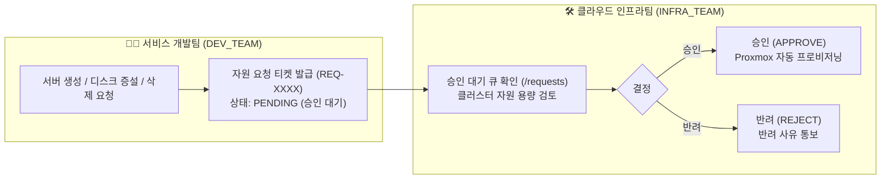
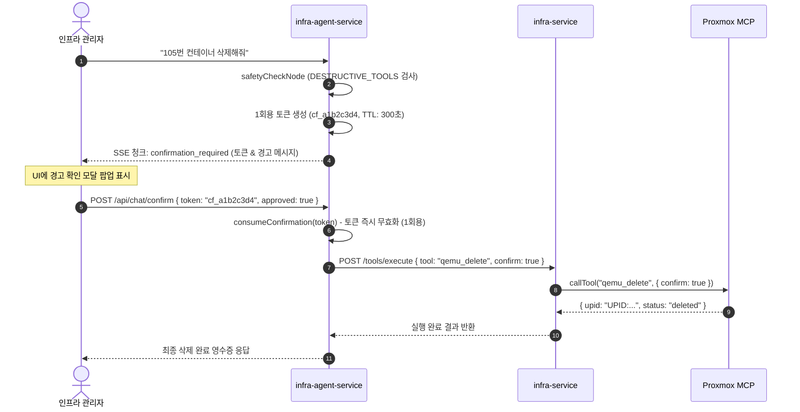

# 🛡️ JEV 거버넌스 및 다계층 가드레일 (Governance & Deep Guardrails)

JEV는 AI의 자율 제어 능력과 엔터프라이즈 인프라의 안전성/컴플라이언스를 동시에 만족시키기 위해 **역할 기반 거버넌스(Role Governance)**와 **3중 심층 방어 가드레일(3-Tier Defense Guardrails)**을 기본 탑재하고 있습니다.

---

## 1. 역할 기반 거버넌스 (Multi-Role Governance)

엔터프라이즈 환경에서 서비스 개발팀과 인프라 운영팀의 책임과 권한을 명확히 분리합니다:

### ① 개발팀 (DEV_TEAM) 모드
- **직접 제어 불가**: 클러스터 노드에 직접 VM 생성, 삭제, 디스크 변경을 가할 수 없습니다.
- **자원 요청서 발급**:
  - UI의 `[+ 신규 자원 요청서 작성]` 모달 또는 AI 챗봇 대화(*"테스트용 서버 한 대 만들어줘"*)를 통해 티켓이 발급됩니다.
  - 티켓은 `PENDING` 상태로 인프라팀 승인 큐에 등록됩니다.
- **추적 및 알림**: 신청한 티켓의 승인 여부, 할당된 `VMID`, Proxmox `UPID`를 실시간으로 확인합니다.

### ② 인프라팀 (INFRA_TEAM) 모드
- **심사 및 자동 프로비저닝**:
  - 개발팀의 대기 티켓을 검토하고, 노드 잔여 용량(RAM, Storage)을 확인합니다.
  - **"승인 및 자동 프로비저닝"** 클릭 또는 AI 챗봇(*"REQ-1001 승인해줘"*) 시, Proxmox MCP를 호출하여 즉시 VM을 프로비저닝(`status: PROVISIONED`)하고 결과를 티켓에 영구 기록합니다.
- **직접 운영 권한**: 인프라 관리자 권한으로 가상머신 기동, 종료, 재부팅 및 긴급 복구를 직접 실행할 수 있습니다.

---

## 2. 3계층 심층 방어 가드레일 (3-Tier Deep Guardrails)

AI의 환각(Hallucination)이나 악의적인 파괴 명령으로부터 클러스터를 완벽히 보호합니다:

| 방어 계층 | 명칭 | 위치 | 보호 대상 작업 | 방어 메커니즘 |
| :---: | :---: | :---: | :---: | :--- |
| **Tier 1** | **역할 거버넌스 가드** | `routerNode` | `CREATE_VM`, `RESIZE_DISK`, `DELETE_VM` | 개발팀의 인프라 변경 시도를 원천 차단하고 `create_resource_request` 티켓으로 격리 |
| **Tier 2** | **파괴적 작업 HITL 게이트** | `safetyCheckNode` | `qemu_delete`, `lxc_delete`, `qemu_force_stop` | 파괴적 명령 감지 시 실행 즉시 중단(Interrupt), 암호학적 1회용 승인 토큰(`cf_xxxx`, 5분 TTL) 발급 |
| **Tier 3** | **마이크로서비스 MCP 가드** | `infra-service` & `ProxmoxMcpClient` | 전원 강제종료, 가상머신 삭제 | AI를 우회한 직접 API 호출 시에도 `confirm: true` 플래그가 없으면 내부 예외 발생 및 실행 차단 |

---

## 3. Human-in-the-Loop(HITL) 승인 토큰 라이프사이클

파괴적 명령이 발생했을 때의 토큰 발급 및 소비 프로세스는 다음과 같습니다:

- **Replay Attack(재사용 공격) 방지**: 토큰은 `consumeConfirmation()` 함수에 의해 읽히는 순간 메모리에서 영구 삭제되므로 중복 실행이 불가능합니다.
- **TTL 자동 만료**: 사용자가 5분 동안 승인하지 않으면 토큰은 자동으로 폐기됩니다.

---

## 4. 감사 로그 및 AI 추론 투명성 (Audit & Observability)

모든 AI의 판단 과정과 인프라 변경 내역은 `AuditService`에 의해 불변(Immutable) 감사 로그로 저장됩니다:

- **AI 툴 판단 로그 (Reasoning Trace)**:
  - 사용자의 발화로부터 AI가 어떤 도구를 선택했는지(`tool`)
  - 왜 이 도구를 선택했는지에 대한 상세한 추론 근거(`why`)
  - 보안 및 거버넌스 평가 등급(`safetyEvaluation`: `SAFE` / `GOVERNANCE` / `CAUTION`)
  - AI 추론 지연 시간(`latencyMs`)
- **인프라 변경 이력**:
  - 액터(`user`, `ai-agent`, `automation-engine`), 작업 유형, 대상 VMID, 프로비저닝된 Proxmox UPID
  - 웹 콘솔 상단의 **[AI 툴 판단 로그]** 모달 및 `/automation` 페이지에서 실시간 조회 가능.

---

## 5. 제어권의 비대칭성: JEV(가드레일 & 툴 콜링) vs LLM(대화 & 응답)

JEV 아키텍처의 가장 중요한 보안 원칙은 **"LLM에게 인프라 직접 실행이나 가드레일 해제 권한을 절대 위임하지 않는다"**는 점입니다:

1. **JEV (결정론적 가드레일 & 툴 콜링 통제)**:
   - 사용자가 어떤 교묘한 프롬프트 주입(Prompt Injection)이나 탈옥(Jailbreak)을 시도하더라도, JEV의 코드 레벨 가드레일(`routerNode`, `safetyCheckNode`)을 우회할 수 없습니다.
   - LLM이 설령 위험한 명령을 추천하더라도, JEV가 사용자의 Role(`DEV_TEAM`)을 확인하는 즉시 `create_resource_request` 티켓으로 강제 전환합니다.
   - 파괴적 작업은 JEV의 메모리 기반 HITL 토큰 엔진이 즉시 가로채어 사용자 승인을 요구합니다.
2. **LLM (대화 처리 & 친절한 응답 생성)**:
   - LLM은 JEV가 인프라를 안전하게 실행하고 반환한 결과 데이터를 받아, 사용자에게 친절하고 명확한 한국어 설명과 마크다운 요약을 생성하는 대화형 인지 엔진의 역할만 전담합니다.
   - 이를 통해 **"보안과 거버넌스는 빈틈없이 결정론적으로 제어하면서도, 사용자는 최첨단 LLM의 유연하고 친절한 대화 경험을 누릴 수 있는 구조"**를 실현합니다.

