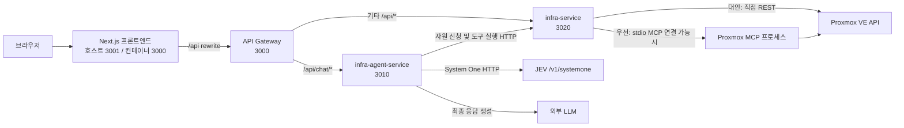
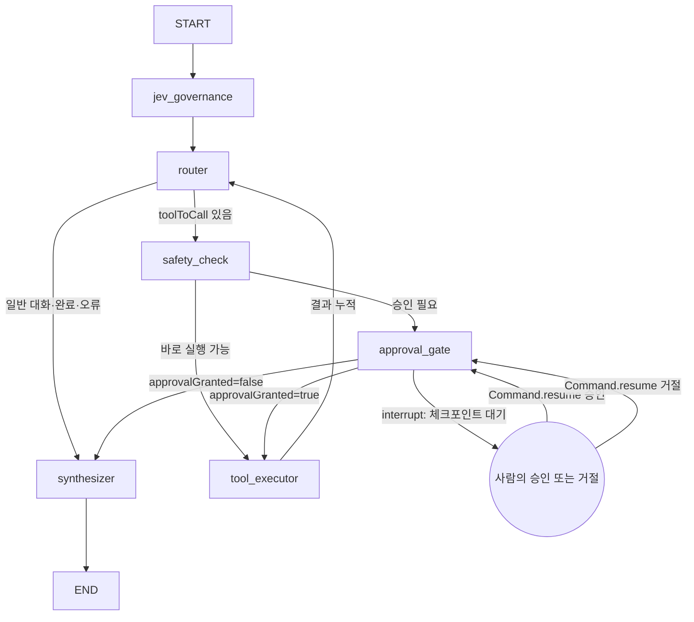

# JEV · LangGraph 아키텍처 학습 및 면접 가이드

이 문서는 **현재 저장소의 구현**을 설명한다. 설계 목표나 제품 소개 문구와 구현을 혼동하지 않기 위해 주요 주장의 근거 파일을 함께 적었다. 코드를 읽는 순서는 `ChatService` → `LangGraphAgentService` → `InfraRemoteClient` → `InfraService`/`ProxmoxMcpClient`가 좋다.

## 1. 30초 설명

> 사용자의 인프라 요청은 Next.js와 API Gateway를 거쳐 NestJS 에이전트 서비스로 들어옵니다. 에이전트는 LangGraph `StateGraph`로 흐름을 관리하고, JEV System One의 Choice 결과로 다음 도구를 선택합니다. 도구 결과를 상태에 누적한 뒤 Jev 라우터로 되돌아가 필요한 작업이 끝났는지 다시 판단합니다. 파괴적 작업은 LangGraph `interrupt()`와 `MemorySaver` 체크포인트에서 멈추고 승인 후 `Command.resume`으로 이어 실행합니다. 외부 LLM은 도구를 고르지 않고 최종 사용자 답변을 생성합니다.

핵심 근거: `backend/apps/infra-agent-service/src/agent/langgraph-agent.service.ts`의 `InfraAgentState`, 그래프 생성자, `routerNode`, `approvalGateNode`, `synthesizerNode`.

## 2. 시스템 경계와 요청 경로



| 컴포넌트 | 실제 책임 | 주요 코드 |
| --- | --- | --- |
| Next.js | 채팅 화면, 승인 버튼, SSE 수신, 그래프 시각화. `/api/*`를 게이트웨이에 rewrite | `frontend/next.config.ts`, `frontend/src/components/chat/ChatConsole.tsx`, `frontend/src/components/chat/LangGraphCanvas.tsx` |
| API Gateway | `/api/chat`을 에이전트로, 다른 `/api`를 인프라 서비스로 프록시. `/stream` 응답은 스트림으로 전달 | `backend/apps/api-gateway/src/proxy/proxy.controller.ts` |
| ChatService | 채팅 SSE 응답, 메시지 이력, 승인 API, 에이전트 결정 감사 기록 | `backend/apps/infra-agent-service/src/chat/chat.service.ts` |
| LangGraphAgentService | 상태 그래프, JEV 라우팅, 코드 검증, 승인 중단/재개, 도구 실행, 최종 응답 | `backend/apps/infra-agent-service/src/agent/langgraph-agent.service.ts` |
| JevClient | 별도 인증으로 System One의 `choice` 질문을 `/v1/systemone`에 POST | `backend/libs/common/src/jev/jev-fetch.service.ts` |
| InfraRemoteClient | 에이전트에서 인프라 서비스로 HTTP 요청. 신청 API와 일반 도구 API를 분리 | `backend/apps/infra-agent-service/src/agent/infra-remote.client.ts` |
| infra-service | Proxmox 조회/변경, 자원 신청 접수/검토, 도구 디스패치 | `backend/apps/infra-service/src/infra/infra.service.ts`, `backend/apps/infra-service/src/resource-request/resource-request.service.ts` |
| ProxmoxMcpClient | 사용 가능한 stdio MCP 연결을 우선 시도하고, 없거나 호출 실패 시 직접 Proxmox REST로 처리 | `backend/apps/infra-service/src/mcp/proxmox-mcp.client.ts`, `backend/apps/infra-service/src/mcp/proxmox-api.client.ts` |

개발용 Compose 포트와 환경 변수는 `infra/docker-compose.yml`을 기준으로 확인한다. 프론트엔드 컨테이너 안에서 게이트웨이는 `localhost`가 아니라 `http://api-gateway:3000`이다.

Compose에는 Redis와 RabbitMQ도 있다. 공통 라이브러리에 Redis 기반 잠금·캐시·설정과 RabbitMQ 통신 모듈이 있지만, **이 문서에서 다루는 채팅 그래프 체크포인트는 Redis에 저장되지 않는다.** 그래프의 Jev 판단과 인프라 도구 호출도 RabbitMQ가 아닌 HTTP 경로다.

### 요청 예시: “노드와 VM 목록 보여줘”

1. 브라우저가 `POST /api/chat/stream`을 보낸다.
2. Next.js rewrite와 Gateway 프록시가 요청을 에이전트로 전달한다.
3. `ChatService.streamChat()`이 사용자 메시지를 저장하고 SSE 헤더를 연다.
4. `processStream()`이 새 `graphRunId`와 `HumanMessage`로 그래프를 시작한다.
5. Jev가 `list_nodes`를 선택하면 `tool_executor`가 인프라 서비스를 호출한다.
6. 결과가 `toolHistory`에 쌓이고 다시 Jev `router`로 돌아간다.
7. Jev가 `cluster_resources`를 선택하면 두 번째 결과도 누적한다.
8. Jev가 `finish`를 선택하면 `synthesizer`가 누적 결과를 LLM에 전달한다.
9. 최종 답변을 SSE `content`로 보내고 `done`으로 HTTP 스트림을 마친다.

이 순서는 **가능한 실행 예시**다. 실제 Jev 선택은 입력과 응답에 따라 달라진다. 테스트는 Jev 응답을 mock하여 두 도구를 연속 실행하는 경로를 검증한다.

## 3. LangGraph 기본 개념과 현재 매핑

| 개념 | 뜻 | 이 저장소의 구현 |
| --- | --- | --- |
| State | 노드가 공유하는 실행 데이터 | `InfraAgentState = Annotation.Root({...})` |
| Node | 상태를 읽고 일부 상태를 갱신하는 함수 | `jev_governance`, `router`, `safety_check`, `approval_gate`, `tool_executor`, `synthesizer` |
| Edge | 다음 노드로 이동하는 연결 | `.addEdge(START, ...)`, `.addEdge('tool_executor', 'router')` 등 |
| Conditional edge | 현재 상태로 다음 노드를 선택하는 분기 | `router`의 `toolToCall`, `safety_check`의 `confirmationNeeded`, `approval_gate`의 `approvalGranted` |
| Reducer | 여러 노드 업데이트를 상태에 결합하는 규칙 | `messages`와 `toolHistory`는 `concat`, 대부분의 필드는 새 값으로 교체 |
| Checkpointer | 실행 지점의 상태와 다음 작업을 보관 | 그래프 컴파일 시 `MemorySaver` 전달 |
| Interrupt / Resume | 사람의 입력을 기다렸다 같은 실행을 계속함 | `approval_gate`의 `interrupt()`, 승인 API의 `Command({ resume })` |

### 실제 그래프



`WAIT`는 설명용 표기다. 실제 코드의 노드는 `approval_gate`이며 `interrupt()`가 그 노드를 중단한다. 중단 후 재개하면 해당 노드가 다시 실행되어 `resume` 값을 받는다. 실제 엣지 정의는 `LangGraphAgentService` 생성자와 `getGraphDefinition()`에 있다.

### 노드별 책임

| 노드 | 읽는 핵심 상태 | 갱신 또는 부작용 | 다음 경로 |
| --- | --- | --- | --- |
| `jev_governance` | 메시지, 역할, 신청자 | 현재 구현은 요청을 로그에 남기고 `{}` 반환. Jev API 호출이나 독립 정책 판정은 하지 않음 | `router` |
| `router` | 원문, 역할, `toolHistory` | Jev Choice 호출, 허용 도구·확률·역할·인수 검사 후 `intent`, `toolToCall`, `decisionWhy` 설정 | 도구가 있으면 `safety_check`, 없으면 `synthesizer` |
| `safety_check` | 선택된 도구, 역할, `graphRunId` | 파괴적 작업이면 5분짜리 토큰 생성, `confirmationNeeded` 설정 | 승인 필요 시 `approval_gate`, 그 외 `tool_executor` |
| `approval_gate` | 토큰, 선택된 도구 | `interrupt()`로 대기. 재개 시 토큰·승인·만료 검증 후 `approvalGranted` 설정 | 승인 시 도구, 거절 시 응답 |
| `tool_executor` | 도구명·인수, 승인 여부 | 인프라 서비스 HTTP 호출. 결과를 `toolResult`로 교체하고 `toolHistory`에 추가 | `router` |
| `synthesizer` | 원문, 실행 이력, 사전 결정 응답 | 설정된 LLM에 결과를 주어 답변 생성. 사전 오류/거절 메시지는 그대로 사용 | `END` |

`tool_executor`가 다시 `router`로 가는 **순환 엣지**가 핵심이다. 보통의 LLM 도구 호출 에이전트는 `LLM → tools → LLM`로 돌아가지만, 여기서는 `JEV router → tool_executor → JEV router`다. LLM이 도구 결과를 보고 추가 도구를 고르는 구조가 아니다.

### State 채널

| 필드 | 의미 | 갱신 방식 |
| --- | --- | --- |
| `messages` | 해당 그래프 실행에 넣은 사용자 메시지. 현재 이전 대화 턴은 주입하지 않음 | `concat` |
| `intent` | 현재 선택 또는 종료/오류 분류 | 새 값 |
| `toolToCall` | 다음 도구의 `{name, args}` 또는 `null` | 새 값 |
| `toolResult` | 가장 최근 도구 결과 | 새 값 |
| `toolHistory` | 이 실행에서 완료된 `{name, args, result}` 목록 | `concat` |
| `confirmationNeeded` | 대기 중 승인 토큰과 대상 | 새 값 |
| `approvalGranted` | 재개 후 파괴적 도구 허용 여부 | 새 값 |
| `decisionWhy`, `safetyEvaluation` | 라우팅 설명과 안전 상태 | 새 값 |
| `finalResponse` | 사용자에게 보낼 최종 문자열 | 새 값 |
| `role`, `requesterName` | 요청에 전달된 역할·신청자 | 새 값 |
| `graphRunId` | 메시지마다 새로 생성되는 체크포인트 ID | 새 값 |

`ChatService`에 전달되는 채팅 `threadId`와 `graphRunId`는 다르다. 전자는 채팅 이력/SSE 식별자다. 후자는 **한 사용자 메시지의 그래프 실행**을 식별하며 LangGraph 설정의 `configurable.thread_id`로 사용된다. 따라서 `MemorySaver`가 채팅 세션 전체의 대화 기억을 제공하는 것은 아니다.

## 4. Jev, LLM, 코드가 각각 결정하는 것

### Jev System One

`routerNode()`는 `JevClient.decide(state, questions)`를 호출한다. `JevClient`는 인증을 적용해 `/v1/systemone`에 `model`, `state`, `questions`를 보낸다. 한 호출에서 다섯 가지 `choice` 질문을 요청한다.

1. `action`: `chat`, `finish`, 조회·신청·검토·QEMU 작업 중 다음 행동.
2. `requestType`: 새 신청의 `CREATE_VM`, `RESIZE_DISK`, `DELETE_VM`.
3. `reviewStatus`: 기존 신청의 `APPROVED` 또는 `REJECTED`.
4. `workload`: 웹, DB, AI, 캐시, 일반.
5. `size`: small, medium, large, unspecified.

첫 판단에는 원문, 역할, 신청자가 들어간다. 재판단에는 **같은 원문**과 완료한 도구명·인수·결과(`completedTools`)가 함께 들어간다. 결과 문자열은 Jev 입력에서 항목당 최대 3,000자로 잘린다. 이미 실행한 작업을 보고 다음 행동 또는 `finish`를 고르라는 지시를 Jev에 준다.

### 코드 검증

Jev 결과를 그대로 실행하지 않는다. 코드가 허용 목록, 선택 확률(`0.65` 이상), `INFRA_TEAM` 전용 도구, 명시적 변경 의사, VMID·노드·REQ 번호 같은 필수 인수를 확인한다. VM 사양은 Jev의 워크로드·규모 Choice를 기본값으로 사용하고 원문에 명시된 CPU/RAM/디스크 숫자로 덮어쓴다. 인수 추출은 정규식 기반이며, 불명확하면 `clarification`으로 종료한다.

무한 순환과 중복 변경을 막기 위해 한 실행의 도구 호출을 최대 3회로 제한한다. 실행했던 **도구명**이 다시 선택되면 종료한다. 도구 결과가 오류면 후속 도구를 실행하지 않는다. 승인된 파괴적 도구를 실행한 뒤에도 종료한다. 같은 도구를 서로 다른 대상에 여러 번 적용하는 계획은 현재 지원하지 않는다.

### 외부 LLM

`synthesizerNode()`만 `ChatOpenAI.invoke()`를 호출한다. 원문과 누적 도구 실행 결과를 시스템 메시지에 넣어 한국어 마크다운 답변을 생성한다. 도구 선택, 권한, 승인 판정에는 LLM 출력이 사용되지 않는다. 연결이 없거나 호출이 실패하면 결과 JSON 또는 고정 오류 문구를 반환한다. 권한 거절, 불명확한 요청, 승인 대기 안내처럼 코드가 이미 답변을 정한 경우에는 LLM을 호출하지 않는다.

인증 정보도 분리된다. Jev는 `JEV_API_KEY` 또는 Basic Auth와 `JEV_BASE_URL`을 사용하고, 최종 응답 모델은 `LLM_API_KEY`, `LLM_BASE_URL`, `LLM_MODEL`을 사용한다.

## 5. 승인 대기와 체크포인터를 정확히 설명하기

1. `router`가 `qemu_delete` 같은 파괴적 작업을 고른다.
2. `safety_check`가 대상과 인수를 포함한 5분짜리 `cf_...` 토큰을 만든다. 토큰과 `graphRunId`는 서비스의 메모리 맵에도 저장된다.
3. `approval_gate`의 `interrupt()`가 그래프를 멈춘다. `MemorySaver`가 상태와 재개할 노드를 `graphRunId`에 저장한다. SSE는 `confirmation_required`와 승인 안내를 보낸다.
4. `POST /api/chat/confirm`에 토큰과 `approved`가 들어오면 `resolveConfirmation()`이 토큰을 **한 번 소비**하고, 체크포인트의 다음 노드가 `approval_gate`인지 확인한다.
5. `Command({ resume: { token, approved } })`로 같은 그래프 실행을 계속한다. `approval_gate`는 전달된 토큰과 만료 시각을 다시 확인한다.
6. 승인 시 `tool_executor`가 `confirm: true`를 붙여 도구를 한 번 호출한다. 거절 시 도구 호출 없이 `synthesizer`로 간다. 완료/만료 시 체크포인트를 정리한다.

**구분할 점:** `MemorySaver`와 승인 토큰 맵은 프로세스 메모리다. 재시작이나 다른 인스턴스에서 이어 받을 수 없다. 이것은 프로세스 내 `interrupt/resume` 구현이며 공유 영속 체크포인트 구현은 아니다. 도구 실행에 대한 분산 원자성·정확히 한 번 실행 보장도 없다. 운영 환경이라면 영속 체크포인터, 토큰 저장, 인증된 승인자 식별, 중복 실행 방지 키가 추가로 필요하다.

## 6. 자원 신청과 직접 도구 실행의 차이

`create_resource_request`는 신청 티켓을 만든다. 실제 VM을 바로 생성하지 않으며 초기 상태는 `PENDING`이다. `list_resource_requests`는 기존 티켓을 조회하고, 개발팀이면 신청자 이름 필터를 전달한다. `review_resource_request`는 인프라팀 검토 요청을 별도 인프라 서비스 API에 보낸다.

인프라 서비스의 `ResourceRequestService`는 승인 시 유형별 후속 작업을 수행한다. `CREATE_VM`과 `RESIZE_DISK`는 Proxmox 도구 호출이 성공하면 `PROVISIONED`, 실패하면 `APPROVED`로 남고 검토 의견에 실패 원인을 붙인다. `DELETE_VM` 신청의 승인 경로는 현재 실제 삭제 도구를 호출하지 않고 `APPROVED`로 표시한다. 따라서 **`APPROVED`와 `PROVISIONED`를 같은 배포 완료 상태로 말하면 부정확하다.** 이 점은 현재 `synthesizer` 프롬프트의 일부 표현과도 일치하지 않는 구현상 한계다.

직접 인프라 명령(`qemu_start`, `qemu_delete` 등)은 티켓이 아니라 원격 도구 실행이다. 에이전트의 `tool_executor`는 `InfraRemoteClient.executeTool()`을 통해 `POST /api/infra/tools/execute`를 호출한다. 인프라 서비스의 `ProxmoxMcpClient`는 MCP stdio 연결이 있으면 이를 시도하고, 사용할 수 없거나 실패하면 직접 REST 클라이언트로 처리한다. 따라서 모든 실제 호출이 항상 MCP 프로토콜을 거친다고 설명하면 안 된다. 직접 REST 구현에서 `qemu_delete`, `qemu_force_stop`, `lxc_delete`는 `confirm: true`를 검사한다.

## 7. 스트리밍, 이력, 관측

- `processStream()`은 LangGraph `streamMode: 'updates'` 결과를 `thought`, `decision`, `tool_start`, `tool_end`, `confirmation_required`, `content`, `done` SSE 청크로 바꾼다.
- `ChatService.streamChat()`은 청크를 HTTP `text/event-stream`으로 내보내고 사용자/에이전트 메시지를 `threadHistories` 맵에 저장한다.
- `AuditService`는 결정과 승인 결과를 메모리 배열에 기록한다. 현재 에이전트 감사 로그는 최근 500개까지만 유지된다.
- 그래프 시각화는 `GET /api/chat/graph`의 노드/엣지 정보와 프론트엔드의 실행 상태를 사용한다. 실행 상태는 SSE 이벤트에서 갱신한다.

채팅 이력, 자원 신청 목록, 에이전트 감사 로그, 체크포인트는 이 코드에서 모두 영속 DB에 저장되지 않는다. 프로세스가 재시작되면 사라진다. `ChatService`의 이력도 현재 사용자별 권한 확인을 거쳐 조회되는 구조는 아니다.

## 8. 현재 보장과 개선 과제

| 주제 | 현재 코드에서 말할 수 있는 범위 | 개선 방향 |
| --- | --- | --- |
| 그래프 | 실행 결과를 Jev로 되돌리는 조건부 순환, 최대 3회 도구 실행 | 복합 작업 계획과 같은 도구의 다른 대상 반복 지원 |
| HITL | 한 프로세스 내 체크포인트 중단/재개, 5분 토큰, 일회성 소비 | Redis/DB 저장, 재시작 복구, 실행 중복 방지 |
| 인증·권한 | 에이전트가 요청 본문의 `role`을 검사 | 서버가 인증 토큰에서 역할·사용자 ID를 확정하고 승인 API에도 강제 |
| 도구 보안 | 에이전트 경로에서 도구 허용 목록·인수·승인 검사 | 인프라 서비스의 일반 도구 실행 API에도 호출자 인증과 정책 적용 |
| 대화 기억 | 현재 그래프에는 해당 요청의 `HumanMessage`만 전달 | 인증된 사용자 단위 대화 기록과 별도 요약/기억 정책 |
| 저장 | 토큰·체크포인트·티켓·로그가 메모리 기반 | 공유 영속 저장소와 장애 복구 |
| Proxmox | MCP stdio 또는 직접 REST 경로 | 연결 상태 관측, 실제 환경 통합 테스트 |

현재 도구 이름 중 `get_storage`는 Jev 라우터의 선택지에 있지만 인프라 서비스의 직접 REST 디스패처에는 `list_storage`만 있다. 그래서 MCP가 연결되지 않은 환경에서 스토리지 조회를 선택하면 실패할 수 있다. 에이전트 테스트의 연속 도구 예시는 원격 클라이언트를 mock하므로 이 이름 불일치를 찾아내지 못한다.

특히 `role`은 `ChatMessageInputDto`의 입력이며 `ChatController`에 인증 가드가 붙어 있지 않다. `INFRA_TEAM` 검사 로직은 존재하지만 현재 API 경계에서 신뢰 가능한 사용자 신원에 바인딩된 권한 검증이라고 주장해서는 안 된다. 또한 인프라 서비스의 일반 도구 실행 엔드포인트는 에이전트의 Jev 라우터를 통과하지 않고도 호출할 수 있는 코드 경로다.

## 9. 면접 예상 질문과 답변

**Q. LangChain 체인과 무엇이 다른가?**  
A. 한 방향으로만 실행하는 파이프라인이 아니라 `tool_executor → router` 순환 엣지가 있다. 상태에 도구 결과가 누적되고 Jev가 다음 행동을 다시 선택한다. 승인 지점에서는 그래프를 중단하고 같은 실행을 재개한다.

**Q. 도구 결과가 나오면 LLM이 다시 도구 호출 여부를 결정하나?**  
A. 아니다. 도구 결과를 `toolHistory`에 추가한 뒤 **Jev**에 `completedTools`로 전달한다. Jev의 `action` Choice가 다음 도구나 `finish`를 고른다. 외부 LLM은 최종 답변 노드에서만 사용한다.

**Q. 도구를 계속 반복하면 어떻게 하나?**  
A. 실행 이력의 도구명을 다시 선택하면 멈추고, 한 그래프 실행에서 최대 3회만 실행한다. 오류나 파괴적 작업 완료 후에도 종료한다. 따라서 현재는 같은 도구를 두 대상에 반복하는 복합 작업을 지원하지 않는다.

**Q. `threadId`와 체크포인트는 같은 것인가?**  
A. 채팅 `threadId`는 사용자 채팅 이력과 SSE 식별자다. 그래프는 메시지별로 별도의 `graphRunId`를 만들어 LangGraph의 `configurable.thread_id`로 사용한다. 승인 토큰이 이 실행 ID를 가리킨다.

**Q. 체크포인터를 썼으니 재시작해도 승인이 살아 있나?**  
A. 아니다. 현재 `MemorySaver`와 토큰 맵은 둘 다 메모리다. 같은 프로세스 안에서 HTTP 요청을 나누어 중단/재개할 수 있지만 재시작 복구는 안 된다.

**Q. `interrupt()`와 단순히 승인 응답을 보내고 함수를 끝내는 방식의 차이는?**  
A. `interrupt()`는 그래프의 현재 상태와 다음 실행 위치를 체크포인트에 남긴다. 승인 API는 새 계획을 만드는 대신 `Command.resume`으로 **같은 그래프 실행**을 이어간다. 승인 여부에 따라 조건부 엣지가 도구 또는 응답 노드로 분기한다.

**Q. Jev가 도구 인수까지 전부 생성하나?**  
A. 아니다. Jev는 제한된 Choice 질문으로 작업·유형·워크로드·규모를 분류한다. VMID·노드·REQ 번호와 명시적 사양은 코드가 원문에서 추출하고 필수값을 검사한다.

**Q. MCP를 반드시 사용하나?**  
A. 아니다. 인프라 서비스가 stdio MCP 연결을 시도하지만 연결할 수 없거나 호출이 실패하면 직접 Proxmox REST 경로를 사용한다. 에이전트와 인프라 서비스 사이는 HTTP다.

**Q. 현재 설계에서 가장 먼저 보강할 부분은?**  
A. 신뢰 가능한 서버 측 사용자 인증/권한 검사와 영속 체크포인트다. 현재 채팅 요청의 역할은 클라이언트가 전달하고, 승인 대기는 프로세스 메모리에만 존재한다. 그 다음에는 원격 도구 실행의 멱등성과 티켓/감사 로그 영속화를 다룰 수 있다.

## 10. 코드 읽기와 검증 순서

1. `backend/apps/infra-agent-service/src/chat/chat.controller.ts`: 채팅·승인·그래프 API.
2. `backend/apps/infra-agent-service/src/chat/chat.service.ts`: SSE 변환, 채팅 이력, 승인 호출.
3. `backend/apps/infra-agent-service/src/agent/langgraph-agent.service.ts`: 상태 채널 → 그래프 엣지 → Jev 라우터 → 승인 게이트 → 도구 실행 → 응답 생성.
4. `backend/libs/common/src/jev/jev-fetch.service.ts`: Jev 인증과 `/v1/systemone` 요청.
5. `backend/apps/infra-agent-service/src/agent/infra-remote.client.ts`: 에이전트와 인프라 서비스의 HTTP 경계.
6. `backend/apps/infra-service/src/infra/infra.service.ts` 및 `backend/apps/infra-service/src/mcp/proxmox-mcp.client.ts`: 실제 도구 디스패치.
7. `backend/apps/infra-agent-service/src/agent/langgraph-agent.service.spec.ts`: Jev 재판단, 순환 제한, 승인·거절·만료 검증.

검증 명령:

```bash
cd backend
pnpm --filter infra-agent-service build
pnpm test:jest --runInBand apps/infra-agent-service/src/agent/langgraph-agent.service.spec.ts

cd ../frontend
pnpm exec tsc --noEmit --incremental false
```

테스트는 Jev와 원격 인프라 클라이언트를 mock한다. 실제 Jev 계정, 실제 Proxmox 연결, 다중 인스턴스 재개, 재시작 복구를 검증하는 통합 테스트는 아니다.
